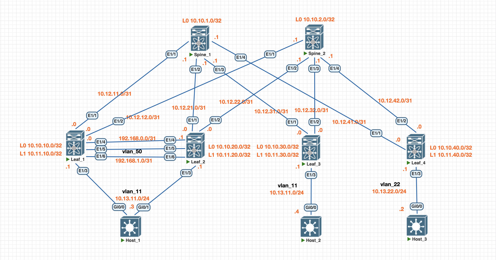

# Адресное пространство и схема сети

# Конфигурации устройств
<details>
<summary> Конфиг Leaf_1 </summary>

```
feature lacp
feature vpc

vlan 50
  name INFRA-VLAN

spanning-tree vlan 1-3967 priority 0

vrf context keepalive

system nve infra-vlans 50

vpc domain 1
  peer-switch
  role priority 15
  peer-keepalive destination 192.168.0.1 source 192.168.0.0 vrf keepalive
  delay restore 120
  peer-gateway
  layer3 peer-router
  auto-recovery
  delay restore interface-vlan 40
  delay restore orphan-port 120
  ip arp synchronize

interface Vlan50
  no shutdown
  no ip redirects
  ip address 192.168.1.0/31
  no ipv6 redirects
  ip ospf authentication key-chain ospf
  ip ospf network point-to-point
  no ip ospf passive-interface
  ip router ospf 0 area 0.0.0.0

interface port-channel13
  description to_Host1
  switchport mode trunk
  switchport trunk allowed vlan 11
  vpc 13

interface port-channel56
  description vPC_PEER_LINKS
  switchport mode trunk
  switchport trunk allowed vlan 11,50,100
  spanning-tree port type network
  vpc peer-link

interface nve1
  advertise virtual-rmac
  source-interface hold-down-time 150

interface Ethernet1/3
  description to_Host1
  switchport mode trunk
  switchport trunk allowed vlan 11
  channel-group 13 mode active

interface Ethernet1/4
  no switchport
  vrf member keepalive
  ip address 192.168.0.0/31
  no shutdown

interface Ethernet1/5
  description vPC_PEER_LINKS
  switchport mode trunk
  switchport trunk allowed vlan 11,50,100
  channel-group 56 mode active

interface Ethernet1/6
  description vPC_PEER_LINKS
  switchport mode trunk
  switchport trunk allowed vlan 11,50,100
  channel-group 56 mode active

interface loopback1
  ip address 10.11.10.1/32 secondary

router bgp 65011
  address-family l2vpn evpn
   advertise-pip
```
</details>

<details>
<summary> Конфиг Leaf_2 </summary>

```
feature lacp
feature vpc

vlan 50
  name INFRA-VLAN

spanning-tree vlan 1-3967 priority 0

vrf context keepalive

system nve infra-vlans 50

vpc domain 1
  peer-switch
  role priority 15
  peer-keepalive destination 192.168.0.0 source 192.168.0.1 vrf keepalive
  delay restore 120
  peer-gateway
  layer3 peer-router
  auto-recovery
  delay restore interface-vlan 40
  delay restore orphan-port 120
  ip arp synchronize

interface Vlan50
  no shutdown
  no ip redirects
  ip address 192.168.1.1/31
  no ipv6 redirects
  ip ospf authentication key-chain ospf
  ip ospf network point-to-point
  no ip ospf passive-interface
  ip router ospf 0 area 0.0.0.0

interface port-channel13
  description to_Host1
  switchport mode trunk
  switchport trunk allowed vlan 11
  vpc 13

interface port-channel56
  description vPC_PEER_LINKS
  switchport mode trunk
  switchport trunk allowed vlan 11,50,100
  spanning-tree port type network
  vpc peer-link

interface nve1
  advertise virtual-rmac
  source-interface hold-down-time 150

interface Ethernet1/3
  description to_Host1
  switchport mode trunk
  switchport trunk allowed vlan 11
  channel-group 13 mode active

interface Ethernet1/4
  no switchport
  vrf member keepalive
  ip address 192.168.0.1/31
  no shutdown

interface Ethernet1/5
  description vPC_PEER_LINKS
  switchport mode trunk
  switchport trunk allowed vlan 11,50,100
  channel-group 56 mode active

interface Ethernet1/6
  description vPC_PEER_LINKS
  switchport mode trunk
  switchport trunk allowed vlan 11,50,100
  channel-group 56 mode active

interface loopback1
  ip address 10.11.10.1/32 secondary

router bgp 65011
  address-family l2vpn evpn
   advertise-pip
```
</details>

# Проверка работоспособности
1. Вывод команд show на устройствах
<details> 
<summary> Leaf_1 </summary>

```
Leaf_1# sho bg l2 e
BGP routing table information for VRF default, address family L2VPN EVPN
BGP table version is 1452, Local Router ID is 10.10.10.0
Status: s-suppressed, x-deleted, S-stale, d-dampened, h-history, *-valid, >-best
Path type: i-internal, e-external, c-confed, l-local, a-aggregate, r-redist, I-injected
Origin codes: i - IGP, e - EGP, ? - incomplete, | - multipath, & - backup, 2 - best2

   Network            Next Hop            Metric     LocPrf     Weight Path
Route Distinguisher: 10.10.10.0:32778    (L2VNI 10011)
*>l[2]:[0]:[0]:[48]:[5000.5a00.800b]:[0]:[0.0.0.0]/216
                      10.11.10.1                        100      32768 i
*>e[2]:[0]:[0]:[48]:[505d.5100.800b]:[0]:[0.0.0.0]/216
                      10.11.30.0                                     0 65000 65013 i
*>l[2]:[0]:[0]:[48]:[5000.5a00.800b]:[32]:[10.13.11.3]/272
                      10.11.10.1                        100      32768 i
*>e[2]:[0]:[0]:[48]:[505d.5100.800b]:[32]:[10.13.11.4]/272
                      10.11.30.0                                     0 65000 65013 i
*>l[3]:[0]:[32]:[10.11.10.1]/88
                      10.11.10.1                        100      32768 i
*>e[3]:[0]:[32]:[10.11.30.0]/88
                      10.11.30.0                                     0 65000 65013 i

Route Distinguisher: 10.10.30.0:32778
* e[2]:[0]:[0]:[48]:[505d.5100.800b]:[0]:[0.0.0.0]/216
                      10.11.30.0                                     0 65000 65013 i
*>e                   10.11.30.0                                     0 65000 65013 i
* e[2]:[0]:[0]:[48]:[505d.5100.800b]:[32]:[10.13.11.4]/272
                      10.11.30.0                                     0 65000 65013 i
*>e                   10.11.30.0                                     0 65000 65013 i
* e[3]:[0]:[32]:[10.11.30.0]/88
                      10.11.30.0                                     0 65000 65013 i
*>e                   10.11.30.0                                     0 65000 65013 i

Route Distinguisher: 10.10.40.0:32789
* e[2]:[0]:[0]:[48]:[50af.2100.8016]:[32]:[10.13.22.2]/272
                      10.11.40.0                                     0 65000 65014 i
*>e                   10.11.40.0                                     0 65000 65014 i

Route Distinguisher: 10.10.10.0:4    (L3VNI 10100)
*>l[2]:[0]:[0]:[48]:[5000.0100.1b08]:[0]:[0.0.0.0]/216
                      10.11.10.1                        100      32768 i
*>e[2]:[0]:[0]:[48]:[505d.5100.800b]:[32]:[10.13.11.4]/272
                      10.11.30.0                                     0 65000 65013 i
*>e[2]:[0]:[0]:[48]:[50af.2100.8016]:[32]:[10.13.22.2]/272
                      10.11.40.0                                     0 65000 65014 i

Leaf_1# show nve internal bgp rnh database
--------------------------------------------
Total peer-vni msgs recvd from bgp: 24
Peer add requests: 14
Peer update requests: 0
Peer delete requests: 11
Peer add/update requests: 14
Peer add ignored (peer exists): 0
Peer update ignored (invalid opc): 0
Peer delete ignored (invalid opc): 0
Peer add/update ignored (malloc error): 0
Peer add/update ignored (vni not cp): 0
Peer delete ignored (vni not cp): 0
--------------------------------------------
Showing BGP RNH Database, size : 3 vni 0

Flag codes: 0 - ISSU Done/ISSU N/A        1 - ADD_ISSU_PENDING
            2 - DEL_ISSU_PENDING          3 - UPD_ISSU_PENDING


VNI       Peer-IP            Peer-MAC            Tunnel-ID  Encap     (A /S ) Flags PT    IRB   Egress-VNI Underlay-VRF TE-Flags     GPC
10011     10.11.30.0         0000.0000.0000      0x0        vxlan     (1 /0 ) 0     FAB   SYM   10011      1            0            0
10100     10.11.30.0         5000.0300.1b08      0xa0b1e00  vxlan     (1 /0 ) 0     FAB   SYM   10100      1            0            0
10100     10.11.40.0         5000.0f00.1b08      0xa0b2800  vxlan     (1 /0 ) 0     FAB   SYM   10100      1            0            0

Leaf_1# sho mac ad
Legend:
        * - primary entry, G - Gateway MAC, (R) - Routed MAC, O - Overlay MAC
        age - seconds since last seen,+ - primary entry using vPC Peer-Link,
        (T) - True, (F) - False, C - ControlPlane MAC, ~ - vsan,
        (NA)- Not Applicable A - ESI Active Path, S - ESI Standby Path
        TL - True Learned, PS - Peer Sync, RO - Re-originate
   VLAN     MAC Address      Type      age     Secure NTFY Ports
---------+-----------------+--------+---------+------+----+------------------
*   11     5000.5a00.800b   dynamic  NA         F      F    Po13
C   11     505d.5100.800b   dynamic  NA         F      F    nve1(10.11.30.0)
*  100     0200.0a0b.0a01   static   -         F      F    Vlan100
*  100     5000.0100.1b08   static   -         F      F    Vlan100
*  100     5000.0300.1b08   static   -         F      F    nve1(10.11.30.0)
*  100     5000.0f00.1b08   static   -         F      F    nve1(10.11.40.0)
G    -     0000.0000.0001   static   -         F      F    sup-eth1(R)
G    -     0200.0a0b.0a01   static   -         F      F    sup-eth1(R)
G    -     5000.0100.1b08   static   -         F      F    sup-eth1(R)
G   11     5000.0100.1b08   static   -         F      F    sup-eth1(R)
G   50     5000.0100.1b08   static   -         F      F    sup-eth1(R)
G  100     5000.0100.1b08   static   -         F      F    sup-eth1(R)
G   11     5000.0200.1b08   static   -         F      F    vPC Peer-Link(R)
G   50     5000.0200.1b08   static   -         F      F    vPC Peer-Link(R)
G  100     5000.0200.1b08   static   -         F      F    vPC Peer-Link(R)
Leaf_1#
```
</details>

<details> 
<summary> Leaf_2 </summary>

```
Leaf_2# sho bg l2 e
BGP routing table information for VRF default, address family L2VPN EVPN
BGP table version is 93, Local Router ID is 10.10.20.0
Status: s-suppressed, x-deleted, S-stale, d-dampened, h-history, *-valid, >-best
Path type: i-internal, e-external, c-confed, l-local, a-aggregate, r-redist, I-injected
Origin codes: i - IGP, e - EGP, ? - incomplete, | - multipath, & - backup, 2 - best2

   Network            Next Hop            Metric     LocPrf     Weight Path
Route Distinguisher: 10.10.20.0:32778    (L2VNI 10011)
*>l[2]:[0]:[0]:[48]:[5000.5a00.800b]:[0]:[0.0.0.0]/216
                      10.11.10.1                        100      32768 i
*>e[2]:[0]:[0]:[48]:[505d.5100.800b]:[0]:[0.0.0.0]/216
                      10.11.30.0                                     0 65000 65013 i
*>l[2]:[0]:[0]:[48]:[5000.5a00.800b]:[32]:[10.13.11.3]/272
                      10.11.10.1                        100      32768 i
*>e[2]:[0]:[0]:[48]:[505d.5100.800b]:[32]:[10.13.11.4]/272
                      10.11.30.0                                     0 65000 65013 i
*>l[3]:[0]:[32]:[10.11.10.1]/88
                      10.11.10.1                        100      32768 i
*>e[3]:[0]:[32]:[10.11.30.0]/88
                      10.11.30.0                                     0 65000 65013 i

Route Distinguisher: 10.10.30.0:32778
* e[2]:[0]:[0]:[48]:[505d.5100.800b]:[0]:[0.0.0.0]/216
                      10.11.30.0                                     0 65000 65013 i
*>e                   10.11.30.0                                     0 65000 65013 i
* e[2]:[0]:[0]:[48]:[505d.5100.800b]:[32]:[10.13.11.4]/272
                      10.11.30.0                                     0 65000 65013 i
*>e                   10.11.30.0                                     0 65000 65013 i
* e[3]:[0]:[32]:[10.11.30.0]/88
                      10.11.30.0                                     0 65000 65013 i
*>e                   10.11.30.0                                     0 65000 65013 i

Route Distinguisher: 10.10.40.0:32789
* e[2]:[0]:[0]:[48]:[50af.2100.8016]:[32]:[10.13.22.2]/272
                      10.11.40.0                                     0 65000 65014 i
*>e                   10.11.40.0                                     0 65000 65014 i

Route Distinguisher: 10.10.20.0:4    (L3VNI 10100)
*>l[2]:[0]:[0]:[48]:[5000.0200.1b08]:[0]:[0.0.0.0]/216
                      10.11.10.1                        100      32768 i
*>e[2]:[0]:[0]:[48]:[505d.5100.800b]:[32]:[10.13.11.4]/272
                      10.11.30.0                                     0 65000 65013 i
*>e[2]:[0]:[0]:[48]:[50af.2100.8016]:[32]:[10.13.22.2]/272
                      10.11.40.0                                     0 65000 65014 i

Leaf_2# show nve internal bgp rnh database
--------------------------------------------
Total peer-vni msgs recvd from bgp: 4
Peer add requests: 3
Peer update requests: 0
Peer delete requests: 1
Peer add/update requests: 3
Peer add ignored (peer exists): 1
Peer update ignored (invalid opc): 0
Peer delete ignored (invalid opc): 0
Peer add/update ignored (malloc error): 0
Peer add/update ignored (vni not cp): 0
Peer delete ignored (vni not cp): 0
--------------------------------------------
Showing BGP RNH Database, size : 3 vni 0

Flag codes: 0 - ISSU Done/ISSU N/A        1 - ADD_ISSU_PENDING
            2 - DEL_ISSU_PENDING          3 - UPD_ISSU_PENDING


VNI       Peer-IP            Peer-MAC            Tunnel-ID  Encap     (A /S ) Flags PT    IRB   Egress-VNI Underlay-VRF TE-Flags     GPC
10011     10.11.30.0         0000.0000.0000      0x0        vxlan     (1 /0 ) 0     FAB   SYM   10011      1            0            0
10100     10.11.30.0         5000.0300.1b08      0xa0b1e00  vxlan     (1 /0 ) 0     FAB   SYM   10100      1            0            0
10100     10.11.40.0         5000.0f00.1b08      0xa0b2800  vxlan     (1 /0 ) 0     FAB   SYM   10100      1            0            0

Leaf_2# sho mac ad
Legend:
        * - primary entry, G - Gateway MAC, (R) - Routed MAC, O - Overlay MAC
        age - seconds since last seen,+ - primary entry using vPC Peer-Link,
        (T) - True, (F) - False, C - ControlPlane MAC, ~ - vsan,
        (NA)- Not Applicable A - ESI Active Path, S - ESI Standby Path
        TL - True Learned, PS - Peer Sync, RO - Re-originate
   VLAN     MAC Address      Type      age     Secure NTFY Ports
---------+-----------------+--------+---------+------+----+------------------
+   11     5000.5a00.800b   dynamic  NA         F      F    Po13
C   11     505d.5100.800b   dynamic  NA         F      F    nve1(10.11.30.0)
*  100     0200.0a0b.0a01   static   -         F      F    Vlan100
*  100     5000.0200.1b08   static   -         F      F    Vlan100
*  100     5000.0300.1b08   static   -         F      F    nve1(10.11.30.0)
*  100     5000.0f00.1b08   static   -         F      F    nve1(10.11.40.0)
G    -     0000.0000.0001   static   -         F      F    sup-eth1(R)
G    -     0200.0a0b.0a01   static   -         F      F    sup-eth1(R)
G   11     5000.0100.1b08   static   -         F      F    vPC Peer-Link(R)
G   50     5000.0100.1b08   static   -         F      F    vPC Peer-Link(R)
G  100     5000.0100.1b08   static   -         F      F    vPC Peer-Link(R)
G    -     5000.0200.1b08   static   -         F      F    sup-eth1(R)
G   11     5000.0200.1b08   static   -         F      F    sup-eth1(R)
G   50     5000.0200.1b08   static   -         F      F    sup-eth1(R)
G  100     5000.0200.1b08   static   -         F      F    sup-eth1(R)
Leaf_2#
```
</details>

<details> 
<summary> Leaf_3 </summary>

```
Leaf_3# sho bg l2 e
BGP routing table information for VRF default, address family L2VPN EVPN
BGP table version is 973, Local Router ID is 10.10.30.0
Status: s-suppressed, x-deleted, S-stale, d-dampened, h-history, *-valid, >-best
Path type: i-internal, e-external, c-confed, l-local, a-aggregate, r-redist, I-injected
Origin codes: i - IGP, e - EGP, ? - incomplete, | - multipath, & - backup, 2 - best2

   Network            Next Hop            Metric     LocPrf     Weight Path
Route Distinguisher: 10.10.10.0:4
*>e[2]:[0]:[0]:[48]:[5000.0100.1b08]:[0]:[0.0.0.0]/216
                      10.11.10.1                                     0 65000 65011 i
* e                   10.11.10.1                                     0 65000 65011 i

Route Distinguisher: 10.10.10.0:32778
* e[2]:[0]:[0]:[48]:[5000.5a00.800b]:[0]:[0.0.0.0]/216
                      10.11.10.1                                     0 65000 65011 i
*>e                   10.11.10.1                                     0 65000 65011 i
*>e[2]:[0]:[0]:[48]:[5000.5a00.800b]:[32]:[10.13.11.3]/272
                      10.11.10.1                                     0 65000 65011 i
* e                   10.11.10.1                                     0 65000 65011 i
* e[3]:[0]:[32]:[10.11.10.1]/88
                      10.11.10.1                                     0 65000 65011 i
*>e                   10.11.10.1                                     0 65000 65011 i

Route Distinguisher: 10.10.20.0:4
* e[2]:[0]:[0]:[48]:[5000.0200.1b08]:[0]:[0.0.0.0]/216
                      10.11.10.1                                     0 65000 65011 i
*>e                   10.11.10.1                                     0 65000 65011 i

Route Distinguisher: 10.10.20.0:32778
* e[2]:[0]:[0]:[48]:[5000.5a00.800b]:[0]:[0.0.0.0]/216
                      10.11.10.1                                     0 65000 65011 i
*>e                   10.11.10.1                                     0 65000 65011 i
* e[2]:[0]:[0]:[48]:[5000.5a00.800b]:[32]:[10.13.11.3]/272
                      10.11.10.1                                     0 65000 65011 i
*>e                   10.11.10.1                                     0 65000 65011 i
* e[3]:[0]:[32]:[10.11.10.1]/88
                      10.11.10.1                                     0 65000 65011 i
*>e                   10.11.10.1                                     0 65000 65011 i

Route Distinguisher: 10.10.30.0:32778    (L2VNI 10011)
*>e[2]:[0]:[0]:[48]:[5000.5a00.800b]:[0]:[0.0.0.0]/216
                      10.11.10.1                                     0 65000 65011 i
* e                   10.11.10.1                                     0 65000 65011 i
*>l[2]:[0]:[0]:[48]:[505d.5100.800b]:[0]:[0.0.0.0]/216
                      10.11.30.0                        100      32768 i
*>e[2]:[0]:[0]:[48]:[5000.5a00.800b]:[32]:[10.13.11.3]/272
                      10.11.10.1                                     0 65000 65011 i
* e                   10.11.10.1                                     0 65000 65011 i
*>l[2]:[0]:[0]:[48]:[505d.5100.800b]:[32]:[10.13.11.4]/272
                      10.11.30.0                        100      32768 i
*>e[3]:[0]:[32]:[10.11.10.1]/88
                      10.11.10.1                                     0 65000 65011 i
* e                   10.11.10.1                                     0 65000 65011 i
*>l[3]:[0]:[32]:[10.11.30.0]/88
                      10.11.30.0                        100      32768 i

Route Distinguisher: 10.10.40.0:32789
* e[2]:[0]:[0]:[48]:[50af.2100.8016]:[32]:[10.13.22.2]/272
                      10.11.40.0                                     0 65000 65014 i
*>e                   10.11.40.0                                     0 65000 65014 i

Route Distinguisher: 10.10.30.0:4    (L3VNI 10100)
*>e[2]:[0]:[0]:[48]:[5000.0100.1b08]:[0]:[0.0.0.0]/216
                      10.11.10.1                                     0 65000 65011 i
*>e[2]:[0]:[0]:[48]:[5000.0200.1b08]:[0]:[0.0.0.0]/216
                      10.11.10.1                                     0 65000 65011 i
*>e[2]:[0]:[0]:[48]:[5000.5a00.800b]:[32]:[10.13.11.3]/272
                      10.11.10.1                                     0 65000 65011 i
* e                   10.11.10.1                                     0 65000 65011 i
*>e[2]:[0]:[0]:[48]:[50af.2100.8016]:[32]:[10.13.22.2]/272
                      10.11.40.0                                     0 65000 65014 i

Leaf_3# show nve internal bgp rnh database
--------------------------------------------
Total peer-vni msgs recvd from bgp: 57
Peer add requests: 33
Peer update requests: 0
Peer delete requests: 30
Peer add/update requests: 33
Peer add ignored (peer exists): 0
Peer update ignored (invalid opc): 0
Peer delete ignored (invalid opc): 0
Peer add/update ignored (malloc error): 0
Peer add/update ignored (vni not cp): 0
Peer delete ignored (vni not cp): 0
--------------------------------------------
Showing BGP RNH Database, size : 3 vni 0

Flag codes: 0 - ISSU Done/ISSU N/A        1 - ADD_ISSU_PENDING
            2 - DEL_ISSU_PENDING          3 - UPD_ISSU_PENDING


VNI       Peer-IP            Peer-MAC            Tunnel-ID  Encap     (A /S ) Flags PT    IRB   Egress-VNI Underlay-VRF TE-Flags     GPC
10011     10.11.10.1         0000.0000.0000      0x0        vxlan     (1 /0 ) 0     FAB   SYM   10011      1            0            0
10100     10.11.40.0         5000.0f00.1b08      0xa0b2800  vxlan     (1 /0 ) 0     FAB   SYM   10100      1            0            0
10100     10.11.10.1         0200.0a0b.0a01      0xa0b0a01  vxlan     (1 /0 ) 0     FAB   SYM   10100      1            0            0

Leaf_3#
```
</details>

<details> 
<summary> Leaf_4 </summary>

```
Leaf_4# sho bgp l2vpn evpn
BGP routing table information for VRF default, address family L2VPN EVPN
BGP table version is 749, Local Router ID is 10.10.40.0
Status: s-suppressed, x-deleted, S-stale, d-dampened, h-history, *-valid, >-best
Path type: i-internal, e-external, c-confed, l-local, a-aggregate, r-redist, I-injected
Origin codes: i - IGP, e - EGP, ? - incomplete, | - multipath, & - backup, 2 - best2

   Network            Next Hop            Metric     LocPrf     Weight Path
Route Distinguisher: 10.10.10.0:4
* e[2]:[0]:[0]:[48]:[5000.0100.1b08]:[0]:[0.0.0.0]/216
                      10.11.10.1                                     0 65000 65011 i
*>e                   10.11.10.1                                     0 65000 65011 i

Route Distinguisher: 10.10.10.0:32778
* e[2]:[0]:[0]:[48]:[5000.5a00.800b]:[32]:[10.13.11.3]/272
                      10.11.10.1                                     0 65000 65011 i
*>e                   10.11.10.1                                     0 65000 65011 i

Route Distinguisher: 10.10.20.0:4
* e[2]:[0]:[0]:[48]:[5000.0200.1b08]:[0]:[0.0.0.0]/216
                      10.11.10.1                                     0 65000 65011 i
*>e                   10.11.10.1                                     0 65000 65011 i

Route Distinguisher: 10.10.20.0:32778
*>e[2]:[0]:[0]:[48]:[5000.5a00.800b]:[32]:[10.13.11.3]/272
                      10.11.10.1                                     0 65000 65011 i
* e                   10.11.10.1                                     0 65000 65011 i

Route Distinguisher: 10.10.30.0:32778
* e[2]:[0]:[0]:[48]:[505d.5100.800b]:[32]:[10.13.11.4]/272
                      10.11.30.0                                     0 65000 65013 i
*>e                   10.11.30.0                                     0 65000 65013 i

Route Distinguisher: 10.10.40.0:32789    (L2VNI 10022)
*>l[2]:[0]:[0]:[48]:[50af.2100.8016]:[0]:[0.0.0.0]/216
                      10.11.40.0                        100      32768 i
*>l[2]:[0]:[0]:[48]:[50af.2100.8016]:[32]:[10.13.22.2]/272
                      10.11.40.0                        100      32768 i
*>l[3]:[0]:[32]:[10.11.40.0]/88
                      10.11.40.0                        100      32768 i

Route Distinguisher: 10.10.40.0:4    (L3VNI 10100)
*>e[2]:[0]:[0]:[48]:[5000.0100.1b08]:[0]:[0.0.0.0]/216
                      10.11.10.1                                     0 65000 65011 i
*>e[2]:[0]:[0]:[48]:[5000.0200.1b08]:[0]:[0.0.0.0]/216
                      10.11.10.1                                     0 65000 65011 i
* e[2]:[0]:[0]:[48]:[5000.5a00.800b]:[32]:[10.13.11.3]/272
                      10.11.10.1                                     0 65000 65011 i
*>e                   10.11.10.1                                     0 65000 65011 i
*>e[2]:[0]:[0]:[48]:[505d.5100.800b]:[32]:[10.13.11.4]/272
                      10.11.30.0                                     0 65000 65013 i

Leaf_4# sho nve internal bgp rnh database
--------------------------------------------
Total peer-vni msgs recvd from bgp: 26
Peer add requests: 15
Peer update requests: 0
Peer delete requests: 13
Peer add/update requests: 15
Peer add ignored (peer exists): 0
Peer update ignored (invalid opc): 0
Peer delete ignored (invalid opc): 0
Peer add/update ignored (malloc error): 0
Peer add/update ignored (vni not cp): 0
Peer delete ignored (vni not cp): 0
--------------------------------------------
Showing BGP RNH Database, size : 2 vni 0

Flag codes: 0 - ISSU Done/ISSU N/A        1 - ADD_ISSU_PENDING
            2 - DEL_ISSU_PENDING          3 - UPD_ISSU_PENDING


VNI       Peer-IP            Peer-MAC            Tunnel-ID  Encap     (A /S ) Flags PT    IRB   Egress-VNI Underlay-VRF TE-Flags     GPC
10100     10.11.30.0         5000.0300.1b08      0xa0b1e00  vxlan     (1 /0 ) 0     FAB   SYM   10100      1            0            0
10100     10.11.10.1         0200.0a0b.0a01      0xa0b0a01  vxlan     (1 /0 ) 0     FAB   SYM   10100      1            0            0

Leaf_4#
```
</details>

2. Проверка доступности сетей c помощью ping
<details>
<summary> ping с Host_1 до осатльных Hosts </summary>

```
Host_1#ping 10.13.11.4
Type escape sequence to abort.
Sending 5, 100-byte ICMP Echos to 10.13.11.4, timeout is 2 seconds:
!!!!!
Success rate is 100 percent (5/5), round-trip min/avg/max = 9/13/25 ms
Host_1#ping 10.13.22.2
Type escape sequence to abort.
Sending 5, 100-byte ICMP Echos to 10.13.22.2, timeout is 2 seconds:
!!!!!
Success rate is 100 percent (5/5), round-trip min/avg/max = 11/11/15 ms
Host_1#
```
</details>

Сценарии отказа с отключением Uplinks, Downkinks, Peer-link, Keepalive-link протестированы. Всё работает согласно заявлению вендора. 

# Заметки
<details>
<summary> Команды настройки vpc domain + best practices </summary>

```
"peer-switch"
1. Before enabling the vPC Peer Switch enhancement, Spanning Tree priority configuration for all vPC VLANs must be modified so that it is identical between both vPC peers.
 
"peer-gateway и layer3 peer-router"
1. If dynamic unicast routing protocol adjacencies are formed between two vPC peers and a vPC-connected router or a router connected through a vPC orphan port, the routing protocol adjacencies can start flapping continuously after enabling the vPC Peer Gateway enhancement if the Routing/Layer 3 over vPC enhancement is not configured immediately afterwards.
2. The vPC Peer Gateway enhancement was introduced to eliminate the packet loss introduced by hosts utilizing this non-standard behavior. This is done by allowing one vPC peer to locally route packets destined to the MAC address of the other vPC peer such that packets destined to the remote vPC peer do not need to egress the vPC Peer-Link in order to be routed. In other words, the vPC Peer Gateway enhancement allows one vPC peer to route packets "on behalf of" the remote vPC peer.
3. When the vPC Peer Gateway enhancement is enabled, the generation of ICMP and ICMPv6 Redirect packets is automatically disabled on all vPC VLAN SVIs (that is, any SVI associated with a VLAN that is trunked across the vPC Peer-Link). The switch does this by configuring no ip redirects and no ipv6 redirects on all vPC VLAN SVIs. This prevents a switch from generating ICMP Redirect packets in response to packets that ingress the switch, but have a destination MAC and IP address of the switch vPC peer.
   If ICMP or ICMPv6 Redirect packets are necessary in your environment within a specific VLAN, you need to exclude this VLAN from taking advantage of the vPC Peer Gateway enhancement using the peer-gateway exclude-vlan <vlan-id> vPC domain configuration command.
4. The Routing/Layer 3 over vPC enhancement was introduced to add support for forming unicast routing protocol adjacencies over a vPC. This is done by allowing unicast routing protocol packets with a TTL of 1 to be forwarded across the vPC Peer-Link without decrementing the TTL of the packet. As a result, unicast routing protocol adjacencies can be formed over a vPC or vPC VLAN without issue. The Routing/Layer 3 over vPC enhancement can be enabled with the layer3 peer-router vPC domain configuration command after the vPC Peer Gateway enhancement has been enabled with the peer-gateway vPC domain configuration command.

"auto-recovery"
1. For best practices, enable auto-recovery in your vPC environment. Although rare, there is a chance that vPC auto-recovery feature can get you in dual active scenario.

"delay restore interface-vlan 45"
1. On vPC VXLAN, it is recommended to increase the delay restore interface-vlan timer under the vPC configuration, if the number of SVIs are scaled up. For example, if there are 1000 VNIs with 1000 SVIs, it is recommended to increase the delay restore interface-vlan timer to 45 seconds.

"graceful consistency-check"
1. Вклюяена поуолчанию.

- For vPC, the loopback interface has two IP addresses: the primary IP address and the secondary IP address

- NVE Hold-Down timer needs to be higher than vPC delay restore timer
```
</details>

<details>
<summary> Ресурсы </summary>
vPC Multi-Homing 

https://www.ciscolive.com/c/dam/r/ciscolive/global-event/docs/2025/pdf/BRKDCN-2912.pdf

https://www.cisco.com/c/en/us/support/docs/switches/nexus-9000-series-switches/218333-understand-and-configure-nexus-9000-vpc.html#toc-hId-1202017133

https://www.cisco.com/c/en/us/support/docs/ios-nx-os-software/nx-os-software/217274-understand-virtual-port-channel-vpc-en.html.

https://www.cisco.com/c/en/us/support/docs/switches/nexus-9000-series-switches/214624-configure-system-nve-infra-vlans-in-vxla.html

EVPN Ethernet Segment Identifier Multi-Homing
https://www.cisco.com/c/en/us/td/docs/dcn/nx-os/nexus9000/106x/configuration/vxlan/cisco-nexus-9000-series-nx-os-vxlan-configuration-guide-release-106x/configuring-esi-tx.html#layer-2-gateway-spanning-tree-protocol

https://www.cisco.com/c/en/us/support/docs/lan-switching/link-aggregation-control-protocol-lacp-8023ad/218331-configure-and-verify-lacp-esi-multi-homi.html#toc-hId-1519436184

https://dev.to/firstpasslab/ditch-the-vpc-peer-link-evpn-esi-multi-homing-on-nexus-9000-with-nx-os-106x-config--264o
</details>

<details>
<summary> Полезные команды </summary>

```
ethanalyzer - снифер пакетов из командной строки nx-os 
Пример: 
ethanalyzer local interface inband display-filter "icmp" limit-captured-frames 0

набор команд test и diagnostic 

show fabric forwarding ip local-host-db vrf all

show system nve infra-vlans

cli alias name wr copy run start 