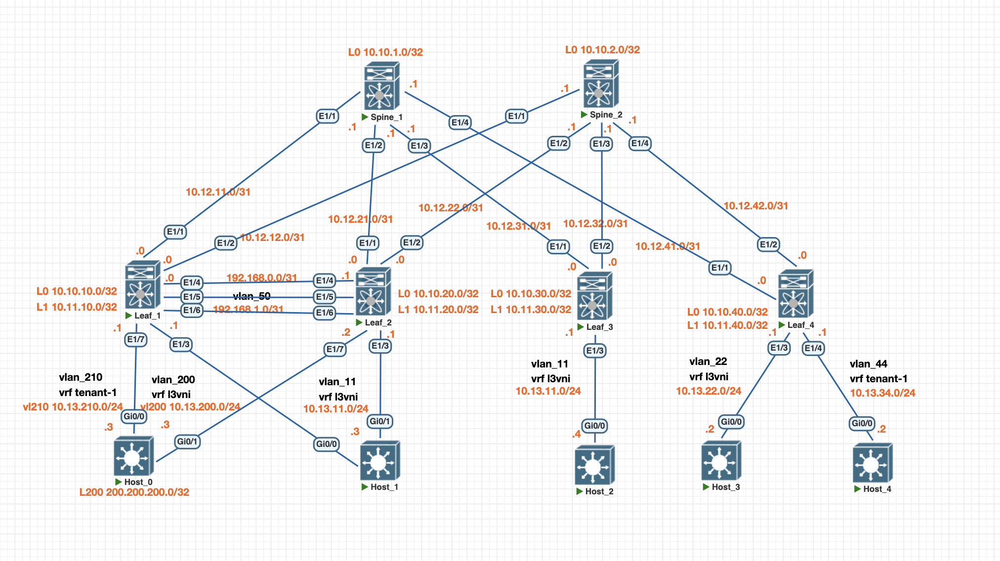

# Адресное пространство и схема сети


# Конфигурации устройств
<details>
<summary> Конфиг Host_0 </summary>

```
vlan 200
 name VL_EXT_CONNECT
!
vlan 210
 name EXT_CONN_TEN-1
!
interface Loopback200
 ip address 200.200.200.0 255.255.255.255
 ip ospf network point-to-point
 ip ospf 1 area 0
!
interface Port-channel17
 switchport trunk allowed vlan 1-49,51-4094
 switchport trunk encapsulation dot1q
 switchport mode trunk
!
interface GigabitEthernet0/0
 switchport trunk allowed vlan 1-49,51-4094
 switchport trunk encapsulation dot1q
 switchport mode trunk
 speed 1000
 duplex full
 no negotiation auto
 channel-group 17 mode active
!
interface GigabitEthernet0/1
 switchport trunk allowed vlan 1-49,51-4094
 switchport trunk encapsulation dot1q
 switchport mode trunk
 speed 1000
 duplex full
 no negotiation auto
 channel-group 17 mode active
!
interface Vlan200
 description INT_EXT_CONNECT
 ip address 10.13.200.3 255.255.255.0
 ip ospf 1 area 0
!
interface Vlan210
 description EXT_CONN_TEN-1
 ip address 10.13.210.3 255.255.255.0
 ip ospf 1 area 0
!
router ospf 1
 router-id 200.200.200.0
```
</details>

<details>
<summary> Конфиг Leaf_1 </summary>

```
vlan 1,11,44,50,100,110,200,210
vlan 11
  vn-segment 10011
vlan 44
  vn-segment 10044
vlan 50
  name INFRA-VLAN
vlan 100
  name l3evpn
  vn-segment 10100
vlan 110
  name tenant-1
  vn-segment 10110
vlan 200
  name VL_EXT_CONNECT
vlan 210
  name EXT_CONN_TEN-1

route-map permit-bgp-ospf permit 10
route-map permit-ospf-bgp permit 10

vrf context l3vni
  vni 10100
  rd auto
  address-family ipv4 unicast
    route-target both auto
    route-target both auto evpn

vrf context tenant-1
  vni 10110
  rd auto
  address-family ipv4 unicast
    route-target both auto
    route-target both auto evpn

interface Vlan11
  no shutdown
  vrf member l3vni
  no ip redirects
  ip address 10.13.11.1/24
  no ipv6 redirects
  fabric forwarding mode anycast-gateway

interface Vlan44
  no shutdown
  vrf member tenant-1
  no ip redirects
  ip address 10.13.34.1/24
  no ipv6 redirects
  fabric forwarding mode anycast-gateway

interface Vlan100
  no shutdown
  vrf member l3vni
  no ip redirects
  ip forward
  no ipv6 redirects

interface Vlan110
  no shutdown
  vrf member tenant-1
  no ip redirects
  ip forward
  no ipv6 redirects

interface Vlan200
  description INT_EXT_CONNECT
  no shutdown
  vrf member l3vni
  no ip redirects
  ip address 10.13.200.1/24
  no ipv6 redirects
  ip router ospf OSPF_EXT_CONNECT area 0.0.0.0

interface Vlan210
  description EXT_CONN_TEN-1
  no shutdown
  vrf member tenant-1
  no ip redirects
  ip address 10.13.210.1/24
  no ipv6 redirects
  ip router ospf EXT_CONN_TEN-1 area 0.0.0.0

interface nve1
  no shutdown
  host-reachability protocol bgp
  advertise virtual-rmac
  source-interface loopback1
  global suppress-arp
  global ingress-replication protocol bgp
  source-interface hold-down-time 150
  member vni 10011
  member vni 10044
  member vni 10100 associate-vrf
  member vni 10110 associate-vrf

router ospf EXT_CONN_TEN-1
  log-adjacency-changes
  vrf tenant-1
    router-id 10.13.210.1
    redistribute bgp 65011 route-map permit-bgp-ospf
    log-adjacency-changes
router ospf OSPF_EXT_CONNECT
  log-adjacency-changes
  vrf l3vni
    router-id 10.13.200.1
    redistribute direct route-map permit-bgp-ospf
    redistribute bgp 65011 route-map permit-bgp-ospf
    log-adjacency-changes

router bgp 65011
  address-family l2vpn evpn
    maximum-paths 2
    advertise-pip
  vrf l3vni
    address-family ipv4 unicast
      redistribute ospf OSPF_EXT_CONNECT route-map permit-ospf-bgp
  vrf tenant-1
    address-family ipv4 unicast
      redistribute ospf EXT_CONN_TEN-1 route-map permit-ospf-bgp
evpn
  vni 10011 l2
    rd auto
    route-target import auto
    route-target export auto
  vni 10044 l2
    rd auto
    route-target import auto
    route-target export auto
```
</details>

<details>
<summary> Конфиг Leaf_2 </summary>

```
vlan 1,11,44,50,100,110,200,210
vlan 11
  vn-segment 10011
vlan 44
  vn-segment 10044
vlan 50
  name INFRA-VLAN
vlan 100
  name l3evpn
  vn-segment 10100
vlan 110
  name tenant-1
  vn-segment 10110
vlan 200
  name VL_EXT_CONNECT
vlan 210
  name EXT_CONN_TEN-1

route-map permit-bgp-ospf permit 10
route-map permit-ospf-bgp permit 10

vrf context l3vni
  vni 10100
  rd auto
  address-family ipv4 unicast
    route-target both auto
    route-target both auto evpn

vrf context tenant-1
  vni 10110
  rd auto
  address-family ipv4 unicast
    route-target both auto
    route-target both auto evpn

interface Vlan11
  no shutdown
  vrf member l3vni
  no ip redirects
  ip address 10.13.11.1/24
  no ipv6 redirects
  fabric forwarding mode anycast-gateway

interface Vlan44
  no shutdown
  vrf member tenant-1
  no ip redirects
  ip address 10.13.34.1/24
  no ipv6 redirects
  fabric forwarding mode anycast-gateway

interface Vlan100
  no shutdown
  vrf member l3vni
  no ip redirects
  ip forward
  no ipv6 redirects

interface Vlan110
  no shutdown
  vrf member tenant-1
  no ip redirects
  ip forward
  no ipv6 redirects

interface Vlan200
  description INT_EXT_CONNECT
  no shutdown
  vrf member l3vni
  no ip redirects
  ip address 10.13.200.2/24
  no ipv6 redirects
  ip router ospf OSPF_EXT_CONNECT area 0.0.0.0

interface Vlan210
  description EXT_CONN_TEN-1
  no shutdown
  vrf member tenant-1
  no ip redirects
  ip address 10.13.210.2/24
  no ipv6 redirects
  ip router ospf EXT_CONN_TEN-1 area 0.0.0.0

interface nve1
  no shutdown
  host-reachability protocol bgp
  advertise virtual-rmac
  source-interface loopback1
  global suppress-arp
  global ingress-replication protocol bgp
  source-interface hold-down-time 150
  member vni 10011
  member vni 10044
  member vni 10100 associate-vrf
  member vni 10110 associate-vrf

router ospf EXT_CONN_TEN-1
  log-adjacency-changes
  vrf tenant-1
    router-id 10.13.210.2
    redistribute bgp 65011 route-map permit-bgp-ospf
    log-adjacency-changes
router ospf OSPF_EXT_CONNECT
  log-adjacency-changes
  vrf l3vni
    router-id 10.13.200.2
    redistribute direct route-map permit-bgp-ospf
    redistribute bgp 65011 route-map permit-bgp-ospf
    log-adjacency-changes

router bgp 65011
  address-family l2vpn evpn
    maximum-paths 2
    advertise-pip
  vrf l3vni
    address-family ipv4 unicast
      redistribute ospf OSPF_EXT_CONNECT route-map permit-ospf-bgp
  vrf tenant-1
    address-family ipv4 unicast
      redistribute ospf EXT_CONN_TEN-1 route-map permit-ospf-bgp
evpn
  vni 10011 l2
    rd auto
    route-target import auto
    route-target export auto
  vni 10044 l2
    rd auto
    route-target import auto
    route-target export auto
```
</details>

<details>
<summary> Конфиг Leaf_3 </summary>

```
vlan 1,11,44,100,110
vlan 11
  vn-segment 10011
vlan 44
  vn-segment 10044
vlan 100
  name l3evpn
  vn-segment 10100
vlan 110
  name tenan-1
  vn-segment 10110

vrf context l3vni
  vni 10100
  rd auto
  address-family ipv4 unicast
    route-target both auto
    route-target both auto evpn

vrf context tenant-1
  vni 10110
  rd auto
  address-family ipv4 unicast
    route-target both auto
    route-target both auto evpn

interface Vlan11
  no shutdown
  vrf member l3vni
  ip address 10.13.11.1/24
  fabric forwarding mode anycast-gateway

interface Vlan44
  no shutdown
  vrf member tenant-1
  ip address 10.13.34.1/24
  fabric forwarding mode anycast-gateway

interface Vlan100
  no shutdown
  vrf member l3vni
  ip forward

interface Vlan110
  no shutdown
  vrf member tenant-1
  ip forward

interface nve1
  no shutdown
  host-reachability protocol bgp
  source-interface loopback1
  global suppress-arp
  global ingress-replication protocol bgp
  member vni 10011
  member vni 10044
  member vni 10100 associate-vrf
  member vni 10110 associate-vrf

router bgp 65013
evpn
  vni 10011 l2
    rd auto
    route-target import auto
    route-target export auto
  vni 10044 l2
    rd auto
    route-target import auto
    route-target export auto
```
</details>

<details>
<summary> Конфиг Leaf_4 </summary>

```
vlan 1,22,44,100,110
vlan 22
  vn-segment 10022
vlan 44
  vn-segment 10044
vlan 100
  name l3evpn
  vn-segment 10100
vlan 110
  name tenan-1
  vn-segment 10110

vrf context l3vni
  vni 10100
  rd auto
  address-family ipv4 unicast
    route-target both auto
    route-target both auto evpn

vrf context tenant-1
  vni 10110
  rd auto
  address-family ipv4 unicast
    route-target both auto
    route-target both auto evpn

interface Vlan22
  no shutdown
  vrf member l3vni
  ip address 10.13.22.1/24
  fabric forwarding mode anycast-gateway

interface Vlan44
  no shutdown
  vrf member tenant-1
  ip address 10.13.34.1/24
  fabric forwarding mode anycast-gateway

interface Vlan100
  no shutdown
  vrf member l3vni
  ip forward

interface Vlan110
  no shutdown
  vrf member tenant-1
  ip forward

interface nve1
  no shutdown
  host-reachability protocol bgp
  source-interface loopback1
  global suppress-arp
  global ingress-replication protocol bgp
  member vni 10022
  member vni 10044
  member vni 10100 associate-vrf
  member vni 10110 associate-vrf

router bgp 65014
evpn
  vni 10022 l2
    rd auto
    route-target import auto
    route-target export auto
  vni 10044 l2
    rd auto
    route-target import auto
    route-target export auto
```
</details>

# Проверка работоспособности
1. Вывод команд show на устройствах
<details> 
<summary> Leaf_1 </summary>

```
Leaf_1# show ip ospf neighbors vrf l3vni
 OSPF Process ID OSPF_EXT_CONNECT VRF l3vni
 Total number of neighbors: 2
 Neighbor ID     Pri State            Up Time  Address         Interface
 10.13.200.2       1 FULL/BDR         3d03h    10.13.200.2     Vlan200
 200.200.200.0     1 FULL/DR          11:39:07 10.13.200.3     Vlan200

Leaf_1# show ip ospf neighbors vrf tenant-1
 OSPF Process ID EXT_CONN_TEN-1 VRF tenant-1
 Total number of neighbors: 2
 Neighbor ID     Pri State            Up Time  Address         Interface
 10.13.210.2       1 FULL/BDR         04:26:40 10.13.210.2     Vlan210
 200.200.200.0     1 FULL/DR          04:26:37 10.13.210.3     Vlan210

Leaf_1# sho ip route ospf-oSPF_EXT_CONNECT vrf l3vni
IP Route Table for VRF "l3vni"
'*' denotes best ucast next-hop
'**' denotes best mcast next-hop
'[x/y]' denotes [preference/metric]
'%<string>' in via output denotes VRF <string>
10.13.34.2/32, ubest/mbest: 1/0
    *via 10.13.200.3, Vlan200, [110/1], 01:06:51, ospf-OSPF_EXT_CONNECT, type-2, tag 65000
10.13.210.0/24, ubest/mbest: 1/0
    *via 10.13.200.3, Vlan200, [110/41], 04:27:28, ospf-OSPF_EXT_CONNECT, intra
200.200.200.0/32, ubest/mbest: 1/0
    *via 10.13.200.3, Vlan200, [110/41], 3d03h, ospf-OSPF_EXT_CONNECT, intra

Leaf_1# sho ip route ospf-eXT_CONN_TEN-1 vrf tenant-1
IP Route Table for VRF "tenant-1"
'*' denotes best ucast next-hop
'**' denotes best mcast next-hop
'[x/y]' denotes [preference/metric]
'%<string>' in via output denotes VRF <string>
10.13.11.0/24, ubest/mbest: 1/0
    *via 10.13.210.3, Vlan210, [110/20], 04:28:15, ospf-EXT_CONN_TEN-1, type-2
10.13.11.4/32, ubest/mbest: 1/0
    *via 10.13.210.3, Vlan210, [110/1], 01:07:43, ospf-EXT_CONN_TEN-1, type-2, tag 65000
10.13.22.2/32, ubest/mbest: 1/0
    *via 10.13.210.3, Vlan210, [110/1], 01:07:42, ospf-EXT_CONN_TEN-1, type-2, tag 65000
10.13.200.0/24, ubest/mbest: 1/0
    *via 10.13.210.3, Vlan210, [110/41], 04:28:15, ospf-EXT_CONN_TEN-1, intra
200.200.200.0/32, ubest/mbest: 1/0
    *via 10.13.210.3, Vlan210, [110/41], 04:28:15, ospf-EXT_CONN_TEN-1, intra


Leaf_1# show bgp l2vpn evpn vrf l3vni
BGP routing table information for VRF default, address family L2VPN EVPN
BGP table version is 26379, Local Router ID is 10.10.10.0
Status: s-suppressed, x-deleted, S-stale, d-dampened, h-history, *-valid, >-best
Path type: i-internal, e-external, c-confed, l-local, a-aggregate, r-redist, I-injected
Origin codes: i - IGP, e - EGP, ? - incomplete, | - multipath, & - backup, 2 - best2

   Network            Next Hop            Metric     LocPrf     Weight Path
Route Distinguisher: 10.10.10.0:4    (L3VNI 10100)
*>l[2]:[0]:[0]:[48]:[5000.0100.1b08]:[0]:[0.0.0.0]/216
                      10.11.10.1                        100      32768 i
*>e[2]:[0]:[0]:[48]:[505d.5100.800b]:[32]:[10.13.11.4]/272
                      10.11.30.0                                     0 65000 65013 i
x e                   10.11.30.0                                     0 65000 65013 i
*>e[2]:[0]:[0]:[48]:[50af.2100.8016]:[32]:[10.13.22.2]/272
                      10.11.40.0                                     0 65000 65014 i
x e                   10.11.40.0                                     0 65000 65014 i
*>l[5]:[0]:[0]:[24]:[10.13.210.0]/224
                      10.11.10.0              41        100      32768 ?
x l[5]:[0]:[0]:[32]:[10.13.11.4]/224
                      10.11.10.0               1        100      32768 ?
x l[5]:[0]:[0]:[32]:[10.13.22.2]/224
                      10.11.10.0               1        100      32768 ?
*>l[5]:[0]:[0]:[32]:[10.13.34.2]/224
                      10.11.10.0               1        100      32768 ?
*>l[5]:[0]:[0]:[32]:[200.200.200.0]/224
                      10.11.10.0              41        100      32768 ?


Leaf_1# show bgp l2vpn evpn vrf tenant-1
BGP routing table information for VRF default, address family L2VPN EVPN
BGP table version is 26446, Local Router ID is 10.10.10.0
Status: s-suppressed, x-deleted, S-stale, d-dampened, h-history, *-valid, >-best
Path type: i-internal, e-external, c-confed, l-local, a-aggregate, r-redist, I-injected
Origin codes: i - IGP, e - EGP, ? - incomplete, | - multipath, & - backup, 2 - best2

   Network            Next Hop            Metric     LocPrf     Weight Path
Route Distinguisher: 10.10.10.0:7    (L3VNI 10110)
*>l[2]:[0]:[0]:[48]:[5000.0100.1b08]:[0]:[0.0.0.0]/216
                      10.11.10.1                        100      32768 i
*>e[2]:[0]:[0]:[48]:[50ab.7900.802c]:[32]:[10.13.34.2]/272
                      10.11.40.0                                     0 65000 65014 i
*>l[5]:[0]:[0]:[24]:[10.13.11.0]/224
                      10.11.10.0              20        100      32768 ?
*>l[5]:[0]:[0]:[24]:[10.13.200.0]/224
                      10.11.10.0              41        100      32768 ?
*>l[5]:[0]:[0]:[32]:[10.13.11.4]/224
                      10.11.10.0               1        100      32768 ?
*>l[5]:[0]:[0]:[32]:[10.13.22.2]/224
                      10.11.10.0               1        100      32768 ?
*>l[5]:[0]:[0]:[32]:[200.200.200.0]/224
                      10.11.10.0              41        100      32768 ?

```
</details>

<details> 
<summary> Leaf_2 </summary>

```
Leaf_2# show ip ospf neighbors vrf l3vni
 OSPF Process ID OSPF_EXT_CONNECT VRF l3vni
 Total number of neighbors: 2
 Neighbor ID     Pri State            Up Time  Address         Interface
 10.13.200.1       1 FULL/DROTHER     3d03h    10.13.200.1     Vlan200
 200.200.200.0     1 FULL/DR          04:48:12 10.13.200.3     Vlan200

Leaf_2# show ip ospf neighbors vrf tenant-1
 OSPF Process ID EXT_CONN_TEN-1 VRF tenant-1
 Total number of neighbors: 2
 Neighbor ID     Pri State            Up Time  Address         Interface
 10.13.210.1       1 FULL/DROTHER     04:32:33 10.13.210.1     Vlan210
 200.200.200.0     1 FULL/DR          02:53:25 10.13.210.3     Vlan210

Leaf_2# show ip route ospf-oSPF_EXT_CONNECT vrf l3vni
IP Route Table for VRF "l3vni"
'*' denotes best ucast next-hop
'**' denotes best mcast next-hop
'[x/y]' denotes [preference/metric]
'%<string>' in via output denotes VRF <string>
10.13.34.2/32, ubest/mbest: 1/0
    *via 10.13.200.3, Vlan200, [110/1], 00:00:36, ospf-OSPF_EXT_CONNECT, type-2, tag 65000
10.13.210.0/24, ubest/mbest: 1/0
    *via 10.13.200.3, Vlan200, [110/41], 04:33:14, ospf-OSPF_EXT_CONNECT, intra
200.200.200.0/32, ubest/mbest: 1/0
    *via 10.13.200.3, Vlan200, [110/41], 04:48:58, ospf-OSPF_EXT_CONNECT, intra

Leaf_2# show ip route ospf-eXT_CONN_TEN-1 vrf tenant-1
IP Route Table for VRF "tenant-1"
'*' denotes best ucast next-hop
'**' denotes best mcast next-hop
'[x/y]' denotes [preference/metric]
'%<string>' in via output denotes VRF <string>
10.13.11.0/24, ubest/mbest: 1/0
    *via 10.13.210.3, Vlan210, [110/20], 02:54:20, ospf-EXT_CONN_TEN-1, type-2
10.13.11.4/32, ubest/mbest: 1/0
    *via 10.13.210.3, Vlan210, [110/1], 00:00:51, ospf-EXT_CONN_TEN-1, type-2, tag 65000
10.13.22.2/32, ubest/mbest: 1/0
    *via 10.13.210.3, Vlan210, [110/1], 00:00:51, ospf-EXT_CONN_TEN-1, type-2, tag 65000
10.13.200.0/24, ubest/mbest: 1/0
    *via 10.13.210.3, Vlan210, [110/41], 02:54:20, ospf-EXT_CONN_TEN-1, intra
200.200.200.0/32, ubest/mbest: 1/0
    *via 10.13.210.3, Vlan210, [110/41], 02:54:20, ospf-EXT_CONN_TEN-1, intra


Leaf_2# show bgp l2vpn evpn vrf l3vni
BGP routing table information for VRF default, address family L2VPN EVPN
BGP table version is 24340, Local Router ID is 10.10.20.0
Status: s-suppressed, x-deleted, S-stale, d-dampened, h-history, *-valid, >-best
Path type: i-internal, e-external, c-confed, l-local, a-aggregate, r-redist, I-injected
Origin codes: i - IGP, e - EGP, ? - incomplete, | - multipath, & - backup, 2 - best2

   Network            Next Hop            Metric     LocPrf     Weight Path
Route Distinguisher: 10.10.20.0:4    (L3VNI 10100)
*>l[2]:[0]:[0]:[48]:[5000.0200.1b08]:[0]:[0.0.0.0]/216
                      10.11.10.1                        100      32768 i
*>e[2]:[0]:[0]:[48]:[505d.5100.800b]:[32]:[10.13.11.4]/272
                      10.11.30.0                                     0 65000 65013 i
*>e[2]:[0]:[0]:[48]:[50af.2100.8016]:[32]:[10.13.22.2]/272
                      10.11.40.0                                     0 65000 65014 i
*>l[5]:[0]:[0]:[24]:[10.13.210.0]/224
                      10.11.20.0              41        100      32768 ?
*>l[5]:[0]:[0]:[32]:[10.13.34.2]/224
                      10.11.20.0               1        100      32768 ?
*>l[5]:[0]:[0]:[32]:[200.200.200.0]/224
                      10.11.20.0              41        100      32768 ?


Leaf_2# show bgp l2vpn evpn vrf tenant-1
BGP routing table information for VRF default, address family L2VPN EVPN
BGP table version is 24340, Local Router ID is 10.10.20.0
Status: s-suppressed, x-deleted, S-stale, d-dampened, h-history, *-valid, >-best
Path type: i-internal, e-external, c-confed, l-local, a-aggregate, r-redist, I-injected
Origin codes: i - IGP, e - EGP, ? - incomplete, | - multipath, & - backup, 2 - best2

   Network            Next Hop            Metric     LocPrf     Weight Path
Route Distinguisher: 10.10.20.0:6    (L3VNI 10110)
*>l[2]:[0]:[0]:[48]:[5000.0200.1b08]:[0]:[0.0.0.0]/216
                      10.11.10.1                        100      32768 i
*>e[2]:[0]:[0]:[48]:[50ab.7900.802c]:[32]:[10.13.34.2]/272
                      10.11.40.0                                     0 65000 65014 i
*>l[5]:[0]:[0]:[24]:[10.13.11.0]/224
                      10.11.20.0              20        100      32768 ?
*>l[5]:[0]:[0]:[24]:[10.13.200.0]/224
                      10.11.20.0              41        100      32768 ?
*>l[5]:[0]:[0]:[32]:[10.13.11.4]/224
                      10.11.20.0               1        100      32768 ?
*>l[5]:[0]:[0]:[32]:[10.13.22.2]/224
                      10.11.20.0               1        100      32768 ?
*>l[5]:[0]:[0]:[32]:[200.200.200.0]/224
                      10.11.20.0              41        100      32768 ?

```
</details>

<details> 
<summary> Leaf_3 </summary>

```
Leaf_3# show bgp l2vpn evpn vrf l3vni
BGP routing table information for VRF default, address family L2VPN EVPN
BGP table version is 52274, Local Router ID is 10.10.30.0
Status: s-suppressed, x-deleted, S-stale, d-dampened, h-history, *-valid, >-best
Path type: i-internal, e-external, c-confed, l-local, a-aggregate, r-redist, I-injected
Origin codes: i - IGP, e - EGP, ? - incomplete, | - multipath, & - backup, 2 - best2

   Network            Next Hop            Metric     LocPrf     Weight Path
Route Distinguisher: 10.10.30.0:4    (L3VNI 10100)
*>e[2]:[0]:[0]:[48]:[5000.0100.1b08]:[0]:[0.0.0.0]/216
                      10.11.10.1                                     0 65000 65011 i
*>e[2]:[0]:[0]:[48]:[5000.0200.1b08]:[0]:[0.0.0.0]/216
                      10.11.10.1                                     0 65000 65011 i
* e[2]:[0]:[0]:[48]:[5000.5a00.800b]:[32]:[10.13.11.3]/272
                      10.11.10.1                                     0 65000 65011 i
*>e                   10.11.10.1                                     0 65000 65011 i
*>e[2]:[0]:[0]:[48]:[50af.2100.8016]:[32]:[10.13.22.2]/272
                      10.11.40.0                                     0 65000 65014 i
*|e[5]:[0]:[0]:[24]:[10.13.210.0]/224
                      10.11.20.0                                     0 65000 65011 ?
*>e                   10.11.10.0                                     0 65000 65011 ?
*|e[5]:[0]:[0]:[32]:[10.13.34.2]/224
                      10.11.20.0                                     0 65000 65011 ?
*>e                   10.11.10.0                                     0 65000 65011 ?
*|e[5]:[0]:[0]:[32]:[200.200.200.0]/224
                      10.11.20.0                                     0 65000 65011 ?
*>e                   10.11.10.0                                     0 65000 65011 ?


Leaf_3# show bgp l2vpn evpn vrf tenant-1
BGP routing table information for VRF default, address family L2VPN EVPN
BGP table version is 52274, Local Router ID is 10.10.30.0
Status: s-suppressed, x-deleted, S-stale, d-dampened, h-history, *-valid, >-best
Path type: i-internal, e-external, c-confed, l-local, a-aggregate, r-redist, I-injected
Origin codes: i - IGP, e - EGP, ? - incomplete, | - multipath, & - backup, 2 - best2

   Network            Next Hop            Metric     LocPrf     Weight Path
Route Distinguisher: 10.10.30.0:5    (L3VNI 10110)
*>e[2]:[0]:[0]:[48]:[5000.0100.1b08]:[0]:[0.0.0.0]/216
                      10.11.10.1                                     0 65000 65011 i
*>e[2]:[0]:[0]:[48]:[5000.0200.1b08]:[0]:[0.0.0.0]/216
                      10.11.10.1                                     0 65000 65011 i
*>e[2]:[0]:[0]:[48]:[50ab.7900.802c]:[32]:[10.13.34.2]/272
                      10.11.40.0                                     0 65000 65014 i
*|e[5]:[0]:[0]:[24]:[10.13.11.0]/224
                      10.11.20.0                                     0 65000 65011 ?
*>e                   10.11.10.0                                     0 65000 65011 ?
*|e[5]:[0]:[0]:[24]:[10.13.200.0]/224
                      10.11.20.0                                     0 65000 65011 ?
*>e                   10.11.10.0                                     0 65000 65011 ?
*|e[5]:[0]:[0]:[32]:[10.13.11.4]/224
                      10.11.20.0                                     0 65000 65011 ?
*>e                   10.11.10.0                                     0 65000 65011 ?
*|e[5]:[0]:[0]:[32]:[10.13.22.2]/224
                      10.11.20.0                                     0 65000 65011 ?
*>e                   10.11.10.0                                     0 65000 65011 ?
*|e[5]:[0]:[0]:[32]:[200.200.200.0]/224
                      10.11.20.0                                     0 65000 65011 ?
*>e                   10.11.10.0                                     0 65000 65011 ?

```
</details>

<details> 
<summary> Leaf_4 </summary>

```
Leaf_4# show bgp l2vpn evpn vrf l3vni
BGP routing table information for VRF default, address family L2VPN EVPN
BGP table version is 31521, Local Router ID is 10.10.40.0
Status: s-suppressed, x-deleted, S-stale, d-dampened, h-history, *-valid, >-best
Path type: i-internal, e-external, c-confed, l-local, a-aggregate, r-redist, I-injected
Origin codes: i - IGP, e - EGP, ? - incomplete, | - multipath, & - backup, 2 - best2

   Network            Next Hop            Metric     LocPrf     Weight Path
Route Distinguisher: 10.10.40.0:4    (L3VNI 10100)
*>e[2]:[0]:[0]:[48]:[5000.0100.1b08]:[0]:[0.0.0.0]/216
                      10.11.10.1                                     0 65000 65011 i
*>e[2]:[0]:[0]:[48]:[5000.0200.1b08]:[0]:[0.0.0.0]/216
                      10.11.10.1                                     0 65000 65011 i
* e[2]:[0]:[0]:[48]:[5000.5a00.800b]:[32]:[10.13.11.3]/272
                      10.11.10.1                                     0 65000 65011 i
*>e                   10.11.10.1                                     0 65000 65011 i
*>e[2]:[0]:[0]:[48]:[505d.5100.800b]:[32]:[10.13.11.4]/272
                      10.11.30.0                                     0 65000 65013 i
*|e[5]:[0]:[0]:[24]:[10.13.210.0]/224
                      10.11.20.0                                     0 65000 65011 ?
*>e                   10.11.10.0                                     0 65000 65011 ?
*|e[5]:[0]:[0]:[32]:[10.13.34.2]/224
                      10.11.20.0                                     0 65000 65011 ?
*>e                   10.11.10.0                                     0 65000 65011 ?
*|e[5]:[0]:[0]:[32]:[200.200.200.0]/224
                      10.11.20.0                                     0 65000 65011 ?
*>e                   10.11.10.0                                     0 65000 65011 ?


Leaf_4# show bgp l2vpn evpn vrf tenant-1
BGP routing table information for VRF default, address family L2VPN EVPN
BGP table version is 31521, Local Router ID is 10.10.40.0
Status: s-suppressed, x-deleted, S-stale, d-dampened, h-history, *-valid, >-best
Path type: i-internal, e-external, c-confed, l-local, a-aggregate, r-redist, I-injected
Origin codes: i - IGP, e - EGP, ? - incomplete, | - multipath, & - backup, 2 - best2

   Network            Next Hop            Metric     LocPrf     Weight Path
Route Distinguisher: 10.10.40.0:5    (L3VNI 10110)
*>e[2]:[0]:[0]:[48]:[5000.0100.1b08]:[0]:[0.0.0.0]/216
                      10.11.10.1                                     0 65000 65011 i
*>e[2]:[0]:[0]:[48]:[5000.0200.1b08]:[0]:[0.0.0.0]/216
                      10.11.10.1                                     0 65000 65011 i
*|e[5]:[0]:[0]:[24]:[10.13.11.0]/224
                      10.11.20.0                                     0 65000 65011 ?
*>e                   10.11.10.0                                     0 65000 65011 ?
*|e[5]:[0]:[0]:[24]:[10.13.200.0]/224
                      10.11.20.0                                     0 65000 65011 ?
*>e                   10.11.10.0                                     0 65000 65011 ?
*|e[5]:[0]:[0]:[32]:[10.13.11.4]/224
                      10.11.20.0                                     0 65000 65011 ?
*>e                   10.11.10.0                                     0 65000 65011 ?
*|e[5]:[0]:[0]:[32]:[10.13.22.2]/224
                      10.11.20.0                                     0 65000 65011 ?
*>e                   10.11.10.0                                     0 65000 65011 ?
*|e[5]:[0]:[0]:[32]:[200.200.200.0]/224
                      10.11.20.0                                     0 65000 65011 ?
*>e                   10.11.10.0                                     0 65000 65011 ?

```
</details>

<details> 
<summary> Host_0 </summary>

```
Host_0#show ip ospf neighbor

Neighbor ID     Pri   State           Dead Time   Address         Interface
10.13.210.1       1   FULL/DROTHER    00:00:34    10.13.210.1     Vlan210
10.13.210.2       1   FULL/BDR        00:00:35    10.13.210.2     Vlan210
10.13.200.1       1   FULL/DROTHER    00:00:33    10.13.200.1     Vlan200
10.13.200.2       1   FULL/BDR        00:00:35    10.13.200.2     Vlan200


Host_0#show ip route
Codes: L - local, C - connected, S - static, R - RIP, M - mobile, B - BGP
       D - EIGRP, EX - EIGRP external, O - OSPF, IA - OSPF inter area
       N1 - OSPF NSSA external type 1, N2 - OSPF NSSA external type 2
       E1 - OSPF external type 1, E2 - OSPF external type 2
       i - IS-IS, su - IS-IS summary, L1 - IS-IS level-1, L2 - IS-IS level-2
       ia - IS-IS inter area, * - candidate default, U - per-user static route
       o - ODR, P - periodic downloaded static route, H - NHRP, l - LISP
       a - application route
       + - replicated route, % - next hop override, p - overrides from PfR

Gateway of last resort is not set

      10.0.0.0/8 is variably subnetted, 8 subnets, 2 masks
O E2     10.13.11.0/24 [110/20] via 10.13.200.2, 04:55:47, Vlan200
                       [110/20] via 10.13.200.1, 04:55:47, Vlan200
O E2     10.13.11.4/32 [110/1] via 10.13.200.2, 00:09:46, Vlan200
                       [110/1] via 10.13.200.1, 00:09:46, Vlan200
O E2     10.13.22.2/32 [110/1] via 10.13.200.2, 00:09:46, Vlan200
                       [110/1] via 10.13.200.1, 00:09:46, Vlan200
O E2     10.13.34.2/32 [110/1] via 10.13.210.2, 00:09:46, Vlan210
                       [110/1] via 10.13.210.1, 00:09:46, Vlan210
C        10.13.200.0/24 is directly connected, Vlan200
L        10.13.200.3/32 is directly connected, Vlan200
C        10.13.210.0/24 is directly connected, Vlan210
L        10.13.210.3/32 is directly connected, Vlan210
      200.200.200.0/32 is subnetted, 1 subnets
C        200.200.200.0 is directly connected, Loopback200
```
</details>

2. Проверка доступности сетей c помощью ping
<details>
<summary> ping с Host_2 vrf l3vni до остальных хостов и до внешней сети </summary>

```
Host_2#ping 10.13.11.3
Type escape sequence to abort.
Sending 5, 100-byte ICMP Echos to 10.13.11.3, timeout is 2 seconds:
!!!!!
Success rate is 100 percent (5/5), round-trip min/avg/max = 10/11/17 ms
Host_2#ping 10.13.22.2
Type escape sequence to abort.
Sending 5, 100-byte ICMP Echos to 10.13.22.2, timeout is 2 seconds:
!!!!!
Success rate is 100 percent (5/5), round-trip min/avg/max = 10/11/14 ms
Host_2#ping 10.13.34.2
Type escape sequence to abort.
Sending 5, 100-byte ICMP Echos to 10.13.34.2, timeout is 2 seconds:
!!!!!
Success rate is 100 percent (5/5), round-trip min/avg/max = 27/40/72 ms
Host_2#ping 200.200.200.0
Type escape sequence to abort.
Sending 5, 100-byte ICMP Echos to 200.200.200.0, timeout is 2 seconds:
!!!!!
Success rate is 100 percent (5/5), round-trip min/avg/max = 10/15/22 ms
Host_2#
```
</details>

<details> 
<summary> ping с Host_4 vrf tenant-1 до остальных хостов и до внешней сети </summary>

```
Host_4#ping 10.13.11.3
Type escape sequence to abort.
Sending 5, 100-byte ICMP Echos to 10.13.11.3, timeout is 2 seconds:
!!!!!
Success rate is 100 percent (5/5), round-trip min/avg/max = 14/16/20 ms
Host_4#ping 10.13.11.4
Type escape sequence to abort.
Sending 5, 100-byte ICMP Echos to 10.13.11.4, timeout is 2 seconds:
!!!!!
Success rate is 100 percent (5/5), round-trip min/avg/max = 25/28/33 ms
Host_4#ping 10.13.22.2
Type escape sequence to abort.
Sending 5, 100-byte ICMP Echos to 10.13.22.2, timeout is 2 seconds:
!!!!!
Success rate is 100 percent (5/5), round-trip min/avg/max = 20/25/30 ms
Host_4#ping 200.200.200.0
Type escape sequence to abort.
Sending 5, 100-byte ICMP Echos to 200.200.200.0, timeout is 2 seconds:
!!!!!
Success rate is 100 percent (5/5), round-trip min/avg/max = 12/17/23 ms
Host_4#
```
</details>